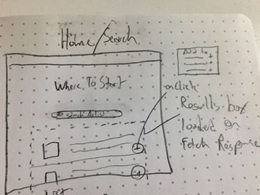
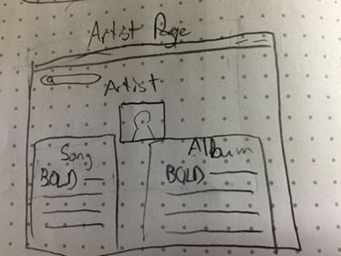
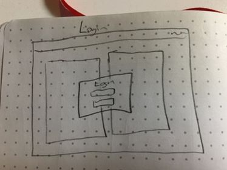
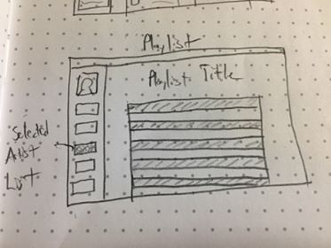
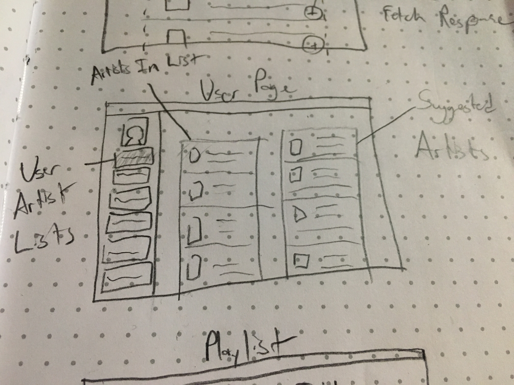

# Where To Start
## Find your entrypoint to your new favorite band

Where To Start is an app that gives a user the ideal entrypoint, either song or album,
 to a recording artist.

It works by searching the last.fm API for top albums or top songs by a particular artists
and gives the user an easy and concise entrypoint to their catalog.  

The user will also be able to add a list of their favorite artists.  

The app will suggest similar artists and entrypoints based on what the user has listed.

## User Stories

A user searches for a music artist, and where to start displays the top recommended album
and top several songs from that artists

A user logs in the server and is able to:

A user adds, views, edits, or deletes artists from a list of their favorites. 

A user hits the "find your next favorite artists" button and a list of similar artists with
their entrypoints is returned

A user creates a playlist of songs that can be CRUD'd.  The user hits the "find similar songs"
button and a list of similar tracks is returned

## MVP

Create a CRUDable list of favorite artists.  

Show a list of similar artists to the ones favorited.  

For each artist, show several albums and tracks that are good entrypoints to their catalog

## Stretch Goals

Integrate Spotify's API to be able to play tracks or albums from the app

Show comments that last.fm users have left on that album or track

Dynamically create playlists based on what is already in the user's library

## Useful Endpoints from Last.fm:

Where to start uses the Last.fm API hosted at http://ws.audioscrobbler.com/2.0/
 to find entrypoints to artists with deep catalogs

artist.getSimilar
artist.getTopAlbums
artist.getTopTracks
artist.getTopTags
artist.getInfo

tag.getSimilar
tag.getTopAlbums
tag.getTopTracks
tag.getInfo

album.getTopTags
album.getInfo

track.getSimilar
track.getTopTags
track.getInfo

## Wireframes:

